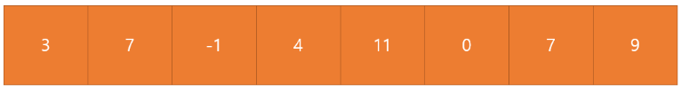

# Linear Search

> 일렬로 된 자료를 왼쪽부터 오른쪽으로 차례대로 탐색

만약 찾고 싶은 수가 4라고 가정하면, 왼쪽부터 4가 있는지 다 살펴본다.
- index 0 : 3 != 4
- index 1 : 7 != 4
- index 2 : -1 != 4
- index 3 : 4 == 4
다음과 같이 찾아 4를 찾으면 탐색을 종료한다.

## Time Complexity
O(N)